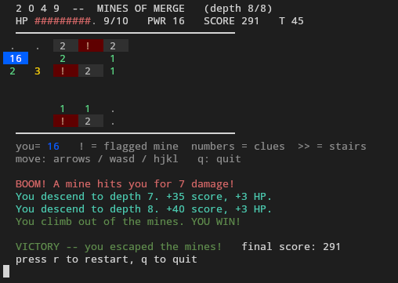
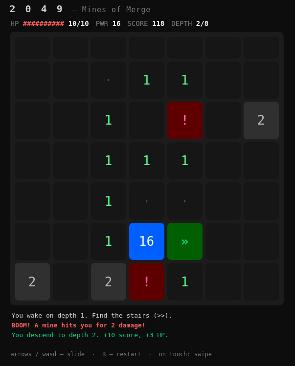

# 2049 - Mines of Merge

<p align="center">
  <a href="https://github.com/skorotkiewicz/2049/actions/workflows/deploy.yml">
    
  </a>
  <a href="LICENSE">
    
  </a>
  
  
</p>

<p align="center">
  <a href="https://sekor.eu.org/2049/"><b>▶ Play in the browser</b></a>
</p>

<p align="center">
  
</p>

<details>
<summary align="center">💻 also runs in the browser (<code>uv run game-web</code>)</summary>
<p align="center">
  
</p>
</details>

A tiny roguelike that fuses **2048** and **Minesweeper**. You *are* the tile:
every move slides the whole dungeon with 2048 rules while hidden mines -
Minesweeper style - wait in the dark. Descend 8 depths and escape.

## Run

```sh
uv run game
```

No dependencies beyond Python itself; everything is managed by `uv`.

### Let the AI play

```sh
OPENROUTER_API_KEY=sk-or-... uv run game --ai
```

`jev.py` asks the `typesafe/jev-1.13` decision model (OpenRouter) one
typed question per turn -- which legal move to slide -- and decides in
~70ms. Press `a` anytime to take over. Without an API key it falls
back to random legal moves.

## Run in the browser

```sh
uv run game-web
```

Serves `web/` and opens your browser. The same `core.py` runs in the
browser via [Pyodide](https://pyodide.org) (Python → WebAssembly, loaded
from CDN on first visit); the frontend is plain HTML/CSS/JS with the same
2048 palette. Works on touch screens too - just swipe.

## How it works

- **2048 half** - every move slides *all* tiles (you included). Slide into an
  equal tile to merge: your power doubles, score goes up. Big merges (32+)
  heal you.
- **Minesweeper half** - mines are invisible and act as walls for tiles
  (tiles piling up against nothing is itself a clue). Standing next to cells
  *probes* them: mines get flagged with `!`, safe cells show a clue number =
  how many mines touch them. **Stepping on any mine explodes it** for
  `1 + depth` damage.
- **Roguelike half** - find the stairs `>>` to descend. Each depth adds
  mines. Run out of moves and the walls crush you. Die and your score is
  all that remains. Reach **depth 8** and climb out to win.

## Controls

| Key | Action |
| --- | --- |
| arrows / `h j k l` | slide up / down / left / right |
| `a` | toggle the AI (jev) |
| `r` | new run |
| `q` | quit |

Best score is saved locally - `localStorage` in the browser,
`~/.config/2049/best.json` in the terminal.

## Layout

```
src/game/
├── core.py    # game state, 2048 slide, mines, probing, descent
├── jev.py     # typesafe/jev-1.13 decision model (--ai autoplay)
├── ui.py      # ANSI board renderer (no deps)
├── input.py   # raw keypress input (POSIX + Windows)
└── main.py    # main loop
```
